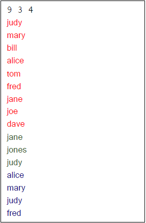

# BST-Names
BST Names is a C program that uses BST structure to search, print and delete a list of string names from a text to help familiarize and practice BST structure. This is for course COP 3502C at the University of Central Florida  
    
Utilized recursion to create fast and efficient functionality in place of loops and BST for it’s efficient sorting algorithm, searching in O(logn) runtime as the best case scenario

# Usage
For your convenience, here is how you could do it in CMD environment.

1. First compile: gcc bstnames.c
2. After compilation, to run the program, you would type the following command: a.exe

# Input
**Input file in.txt:**  
  

# Output
**Output file out.txt:**  
  

